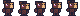

Seguem aqui alguns recursos ótimos para o aprendizado de Pixel Art, desde tamanho de canvas, coloração, até técnicas utilizadas por mestres da Nintendo para fazer as incríveis artes dos antigos jogos como os Pokemon da época.

### Sites/Blogs ótimos para referência e aprendizado

- Blog de um artista de Pixel Art que encontrei na IndieWeb: [SLYNYRD](https://www.slynyrd.com/blog/2026/1/26/side-view-run-n-gun)
- Blog de um internauta sobre Pixel Art: [Saint 11](https://saint11.art/blog/glossary/) (Este site tem ótimos tutoriais em animação e técnicas de Pixel Art)

Ambos os artistas que mantém os sites acima estão desenvolvendo ou já desenvolveram jogos com suas artes, os jogos podem ser encontrados em seus sites.

### Vídeos sobre Pixel Art que recomendo:

- [Brandon James Greer - “How do you start Pixel Art?”…Here’s what I did!](https://www.youtube.com/watch?v=WUlgvNe4BLU)
- [Brandon James Greer - The Pixel-Perfect Art of Pokémon Trainer Sprites](https://www.youtube.com/watch?v=lhib8WV5rCM&t=541s)
- [Pixel Overload - How to Draw Pixel Art Trees! (My method)](https://www.youtube.com/watch?v=VLuKpgkOuKM)
- [Pixel Overload - What Canvas Size Should you use for Pixel Art? (Pixel Art Tutorial) (My method)](https://www.youtube.com/watch?v=Z8earctNBxg)
- [Pixel Overload - How to make Parallax Backgrounds (Pixel Art Tutorial)](https://www.youtube.com/watch?v=7_qw0tWR3yk)
- [Juniper Dev - The ONLY Pixel Art Guide You Need (Beginner to Advanced)](https://www.youtube.com/watch?v=DKmrBUpd0yw&t=293s)
- [Goodgis - Your Game Art Isn’t Bad. You’re Just Skipping This Step.](https://www.youtube.com/watch?v=Kir-7WEHnnU)

### Sobre os recursos acima

Como pode ver, o canal **Pixel Overload** aparece algumas vezes, isso é porque é uma ótima fonte para inspiração e aprendizado no tema, principalmente se estiver fazendo sua arte para um vídeogame.

Já os primeiros dois, de Brandon, são ótimos vídeos para entender um pouco mais sobre algumas das técnicas utilizadas nos jogos antigos a fim de ter mais detalhe mesmo com poucos píxels, como dithering por exemplo.

### Um pouco do que fiz com o que aprendi

O Motivo da minha pesquisa e estudo no tema de pixel art vem do projeto que estamos desenvolvendo no curso de Ciência da Computação na UniFil, que envolve o desenvolvimento de um jogo 2D no caso do meu grupo.

Pode saber mais sobre o projeto clicando [aqui.](https://witordev.github.io/ecorunner_website/)

Portanto, tenho feito algumas pixel art, abaixo seguem algumas prints das artes que fiz. :)

### Personagem do jogador

### NPCs do jogo

